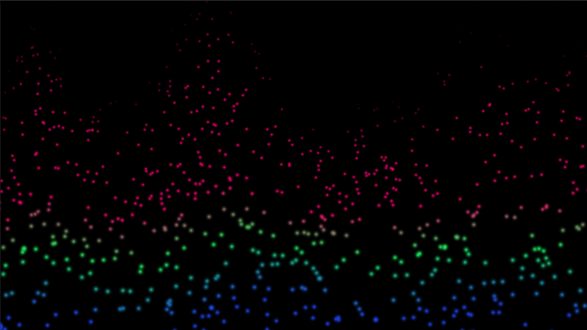

# Particles-System
A WebGL application using the internal Unity System Particle in 2D

Try out the live demo at:
[Demo Live](https://douglaskosvoski.github.io/Particles-System/WebGL_Build/index.html)
